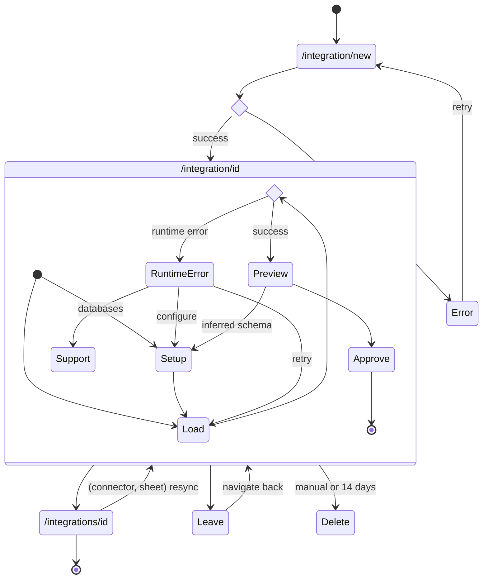

If tables are de-selected in setup stage after initial sync, manually delete in BigQuery.

Error states:

- upload: file too large, connection lost
- connector: authorization failed
- sheet: invalid URL, cannot access, invalid cell range
