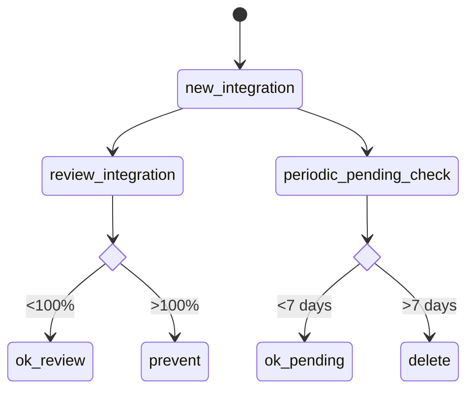
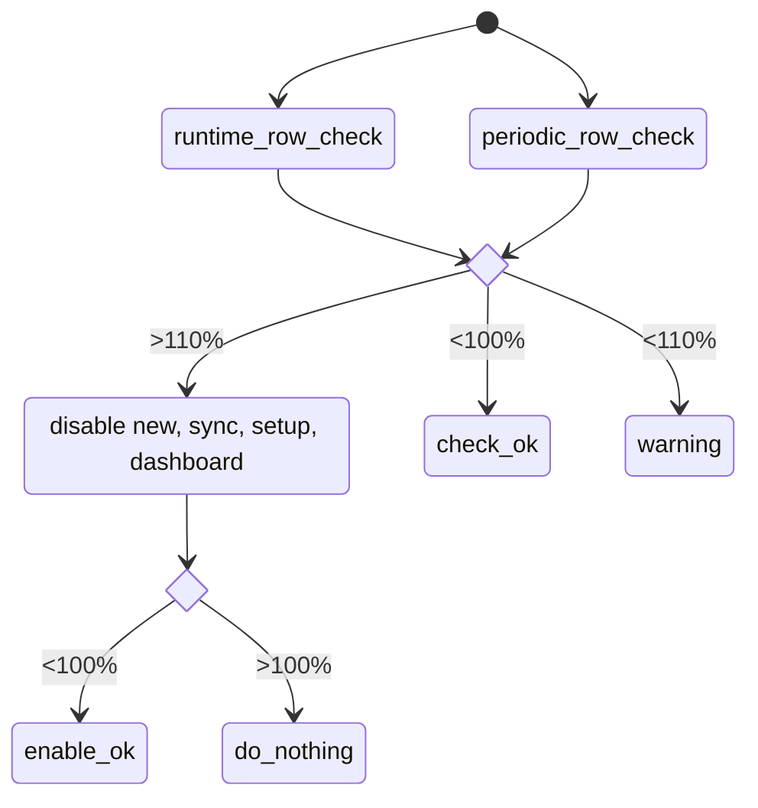

## Proactive

- stop user adding new data to exceed limit
- delete pending after 14 days

```mermaid
stateDiagram-v2
    state if_review <<choice>>
    state if_pending <<choice>>

    [*] --> new_integration
    new_integration --> review_integration
    review_integration --> if_review
    if_review --> ok_review: <100%
    if_review --> prevent: >100%
    new_integration --> periodic_pending_check
    periodic_pending_check --> if_pending
    if_pending --> ok_pending: <7 days
    if_pending --> delete: >7 days
```

## Reactive

- check that new sync has exceeded

```mermaid
stateDiagram-v2
    state if_disable <<choice>>
    state if_enable <<choice>>
    disable: disable new, sync, setup, dashboard

    [*] --> periodic_row_check
    [*] --> runtime_row_check
    runtime_row_check --> if_disable
    periodic_row_check --> if_disable
    if_disable --> check_ok: <100%
    if_disable --> warning: <110%
    if_disable --> disable: >110%
    disable --> if_enable
    if_enable --> enable_ok: <100%
    if_enable --> do_nothing: >100%
```
