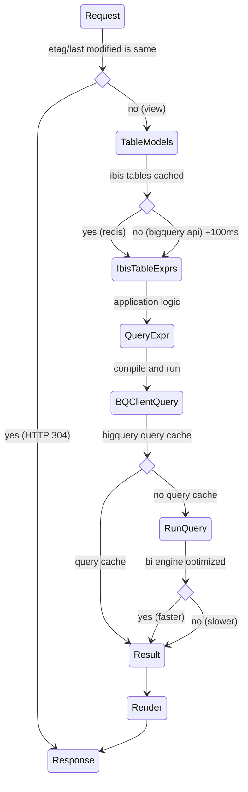

# BigQuery

Actionable points for developers:

- Avoid multiple BigQuery requests
- Profile changes to querying architecture with [Honeycomb](https://www.honeycomb.io/)

Details on performance optimisations for BigQuery queries:

- Enable [BI Engine](https://cloud.google.com/bi-engine/docs/introduction) to
  speed up interactive queries
- Enable [query cache](https://cloud.google.com/bigquery/docs/cached-results)
  API setting for caching duplicate queries (default)
- Monkey patch `ibis.client._execute` to use the [query_and_wait](https://github.com/googleapis/python-bigquery/pull/1722)
  method of BigQuery Client, rather than job creation plus waiting in separate
  API requests.
- Write the code to avoid more than one request to BigQuery query endpoint,
  unless it is actually unavoidable.
- Cache the Ibis schema for our table models, using `data_updated` for cache
  invalidation.
- Use etag/last modified headers to cache on the client (browser), if the
  computed data for a view is unchanged, again using `data_updated` of each
  table plus the hash of the computation applied to the tables.

The lifecycle of a request with caches:

