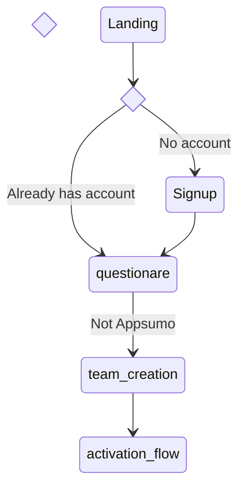
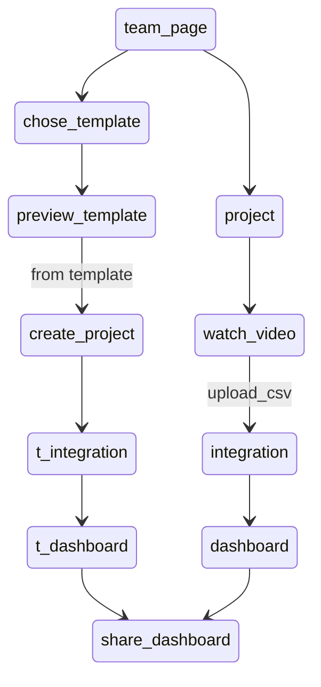

## Sign-up flow

```mermaid
stateDiagram-v2
  state if_code_valid <<choice>>
  state has_account <<choice>>

  Landing --> has_account
  has_account --> questionare: Already has account
  has_account --> Signup: No account
  Signup --> questionare

  questionare --> team_creation: Not Appsumo
  team_creation --> activation_flow
```

## Activation Flow

```mermaid
stateDiagram-v2
  watch_video

  team_page --> project
  team_page --> chose_template
  chose_template --> preview_template
  preview_template --> create_project: from template
  create_project --> t_integration
  t_integration --> t_dashboard
  t_dashboard --> share_dashboard

  project --> watch_video
  watch_video --> integration: upload_csv
  integration --> dashboard
  dashboard --> share_dashboard

```

TODOs

- Add welcome to team overview for choice between project/templates
